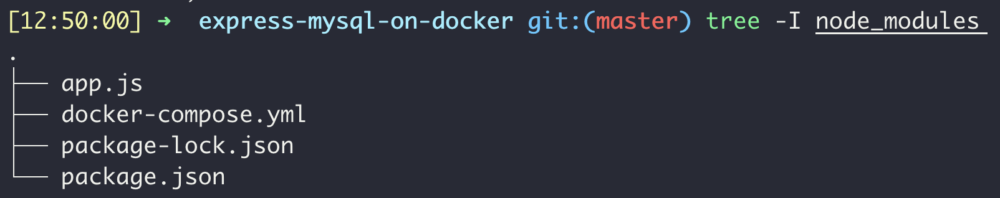
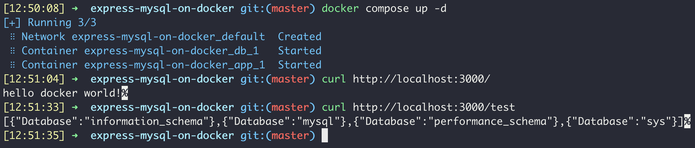
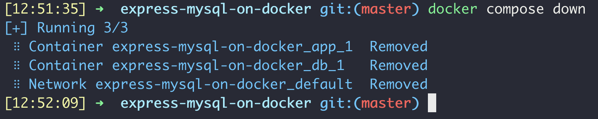

# 도커에서 mysql, express 서버 연결하기

</br>

# 목표

(드디어!) docker 위에서 express와 mysql을 연결하기

</br>

# 해야 할 것

- [x]  `docker-compose.yml`에서 두 서비스를 연결하기
- [x]  express 코드에서 mysql 서버에 연결하도록 수정하기

</br>

# 코드 작성

- `docker-compose.yml`에서 두 서비스를 연결하기

```docker
version: "3.9"
services:
  db:
    image: 
      mysql
    environment:
      MYSQL_ROOT_PASSWORD: "1111"
    ports:
      - "5000:3306"
    command:          # 새로 추가된 부분
      --default-authentication-plugin=mysql_native_password
  app:
    image: 
      node
    volumes:
      - ./:/app
    working_dir:
      /app
    command: 
      bash -c "npm install && node app.js"
    ports:
      - "3000:3000"
    environment:       # 새로 추가된 부분
      MYSQL_HOST: db
    depends_on:        # 새로 추가된 부분
      - db
```

</br>

- express 코드에서 mysql 서버에 연결하도록 수정하기

```jsx
/* library */
const express = require('express')
const logger = require('morgan')

/* app */
const app = express()
const port = 3000

/* mysql */
// 새로 추가된 부분
const mysql = require('mysql')
const connection = mysql.createConnection({
	"host": process.env.MYSQL_HOST,
	"user": "root",
	"password": "1111"
})

/* middleware */
app.use(logger('dev'))

app.get('/', (req, res) => res.status(200).send('hello docker world!'))

// 새로 추가된 부분
app.get('/test', (req, res) => {
	connection.query("show databases", (err, rows) => {
		if (err) {
			res.status(400).send(err)
		} else {
			res.status(200).send(rows)
		}
	})
})

/* listening */
app.listen(port, () => console.log(`server is listening at localhost:${port}`))
```

</br>

# 실행 확인



</br>

- 실행하기: `docker compose up -d`



</br>

- 종료하기: `docker compose down`



</br>

# 후기

- `Dockerfile` 싫어요.
- 연결하는게 생각보다 좀 골치아픈 작업이었는데, `docker-compose.yml`가 당최 어떻게 작동하는지 몰라서 그랬던 것 같다. 이제 `docker-compose.yml`을 어떻게 쓰는지 알고나니까 한결 쉬워졌다.

</br>

# QA

- 서비스들을 연결하려면 예전에는 `links` 옵션을 사용했는데, 이제는 같은 네트워크 안에 있으면 서비스 이름으로 그냥 부를 수 있음. 그래서 `links`는 deprecated.

[Difference between links and depends_on in docker_compose.yml](https://stackoverflow.com/questions/35832095/difference-between-links-and-depends-on-in-docker-compose-yml)

- 그런데 서비스 이름으로 "부른다"는게 뭘까?